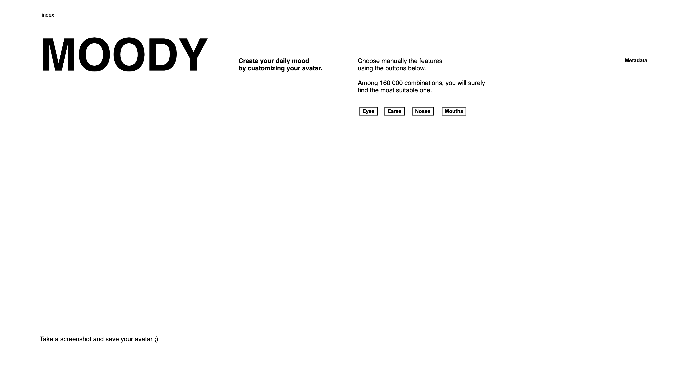
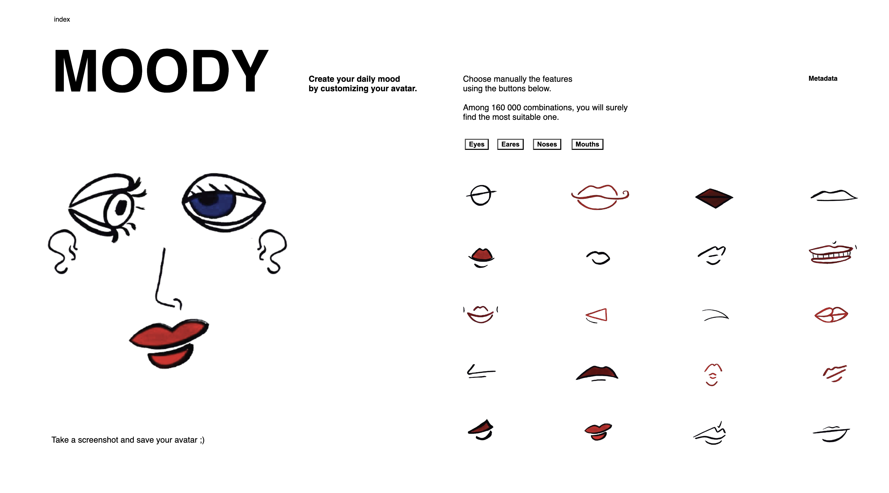
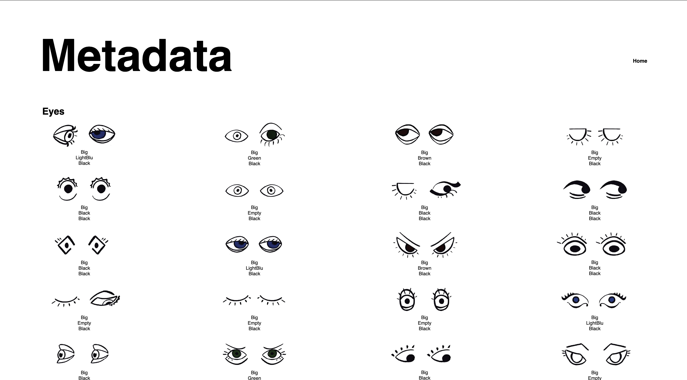

SUPSI 2023-24  
Corso d’interaction design, CV427.01  
Docenti: A. Gysin, G. Profeta  

Elaborato 1: Moody  

# MOODY
Autore: Margherita Lavagnini  
[MediaPipe demo-ES6](https://margheritalavagnini.github.io/MOODY/)

## Introduzione e tema
“MOODY” è un sito web interattivo che offre un’esperienza unica di espressione creativa. Il sito permette agli utenti di personalizzare le espressioni facciali per rappresentare il loro stato d’animo. “MOODY” combina interattività, espressione creativa, semplicità e divertimento per offrire un’esperienza unica agli utenti. Che tu sia un artista digitale, un designer o semplicemente alla ricerca di un modo divertente per esprimere il tuo stato d’animo, “MOODY” ha qualcosa da offrire a tutti.

## Riferimenti progettuali
Non mi sono basata su un esempio preciso di progettazione poiché ritenevo importante offrire agli utenti un'esperienza diversa. Per quanto riguarda la progettazione delle illustrazioni singole, mi sono ispirata alle opere artistiche di Picasso, noto per combinare vari tipi di tratti artistici e prospettive.

## Design dell’interfraccia e modalià di interazione
Il sito web presenta un titolo in grassetto “MOODY” su uno sfondo bianco. Gli utenti sono guidati da istruzioni che li invitano a creare manualmente il loro avatar cambiando ogni parte facendo clic su di essa. Questa personalizzazione è possibile grazie a una serie di caratteristiche facciali visualizzate sul lato destro della pagina web. Le caratteristiche sono raggruppate in quattro categorie: Occhi, Orecchie, Nasi, Bocche. La parte principale della pagina mostra le istruzioni per la creazione dell'avatar. Infine, nell’angolo in alto a destra, gli utenti possono trovare una sezione etichettata “Metadati”. Cliccando sull'etichetta è possibile visualizzare tutte le illustarzioni suddivise per categorie di soggetto; sotto a ogni immagini vengono mostrate le caratteristiche di ogni illustarzione.  Nel complesso, l’interfaccia del sito web appare semplice e intuitiva, offrendo agli utenti la possibilità di esprimere la propria personalità tramite un metodo 

## Tecnologia usata
Il codice HTML è strutturato con diverse sezioni e bottoni per selezionare le caratteristiche dell'avatar. Ogni sezione include un bottone che, una volta cliccato, mostra una griglia di immagini rappresentanti le opzioni disponibili per quella caratteristica. Le immagini sono contenute in elementi 
 con la classe "box". Quando un'immagine viene cliccata, viene visualizzata nell'output corrispondente sotto la griglia delle opzioni.
Con l'implemento di json è possibile anche andare a visualizzare le caraterristiche delle parti che compongono il viso vendono una suddivisione per colore, contorno e dimensione inerente a ogni singola illustrazione.
JavaScript gioca un ruolo cruciale nell'aggiungere interattività alla pagina. Gli script gestiscono la visibilità dei diversi contenitori che contengono le immagini delle varie parti dell'avatar. Inoltre, gli eventi di clic sui pulsanti e sulle immagini aggiornano dinamicamente la visualizzazione dell'avatar selezionato.
Il progetto supporta il responsive design grazie al meta tag <meta name="viewport" content="width=device-width, initial-scale=1.0">, che garantisce una corretta visualizzazione su dispositivi con schermi di diverse dimensioni.

## Target e contesto d’uso
Il sito web “MOODY” è progettato per un pubblico che apprezza l’interattività, l’espressione creativa, la semplicità e il divertimento. L’interfaccia interattiva del sito permette agli utenti di personalizzare le espressioni facciali, rendendolo attraente per gli utenti che apprezzano l’interattività e la personalizzazione. Inoltre, la possibilità di esprimere i propri stati d’animo attraverso la personalizzazione delle caratteristiche facciali potrebbe attrarre artisti digitali e designer alla ricerca di nuovi modi per esprimere la loro creatività. La semplicità dell’interfaccia del sito la rende accessibile a un ampio pubblico di utenti, non solo a quelli con competenze tecniche. Infine, la possibilità di esprimere gli stati d’animo in modo divertente e unico potrebbe attrarre gli utenti alla ricerca di un’esperienza di navigazione leggera e divertente. In conclusione, il sito web “MOODY” è progettato per attrarre un pubblico che apprezza l’interattività, l’espressione creativa, la semplicità e il divertimento.

